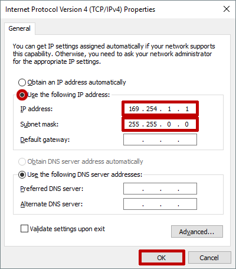
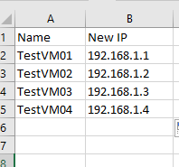

This script reaches out to each computer you have in your .csv and sets a static IP for it. Will you ever use it? Probably not because luckily, DHCP is a thing.
I personally found it useful for a few very specific scenarios so here it is anyway 🙂

First, create a `.csv` file that looks like this:
???+ note inline
    you can use different names for the headers, just make sure to change them in the script as well



Make sure you use “Name” and “New IP” as seen in the pictures.

!!! info inline end
        Don't forget to change the `$GW` variable to your GW's IP.
```powershell
$vcenter = Read-Host ("Enter VCenter:")
Connect-VIServer $vcenter
$IPs = Import-Csv "C:\temp\newIPs.csv"
$GW = "GW" # Change this to Gateway of your choosing!
foreach ($item in $IPs)
{
    $hostname = $item.("Name")
    $New_IP = $item.("New IP")
    Invoke-Command -ComputerName $hostname -ScriptBlock {New-NetIPAddress -IPAddress $using:New_IP -DefaultGateway $using:GW -PrefixLength 24 -InterfaceIndex (Get-NetAdapter).InterfaceIndex -AsJob}
    Get-Job | Stop-Job
}
```


The script will set the static IPs of your choosing to your VMs. 

Enjoy 😊

???+ note "Notes"
    * You will need to enable WinRM
    * Don't forget to change the path of the script