There is the traditional way of importing drivers where you download driver packs, import the drivers and then create a package for them.

I decided to go with a less known, but better way of applying drivers to your OSD.

First, we’ll download the drivers we want to apply. For this example, I will use drivers for **HP 840 G3**.

???+ note "Drivers for HP"
    Each vendor has driver packs for his computers. In my case, [this is HP’s website](http://ftp.hp.com/pub/caps-softpaq/cmit/HP_Driverpack_Matrix_x64.html).

I’ll find the latest drivers and download them.

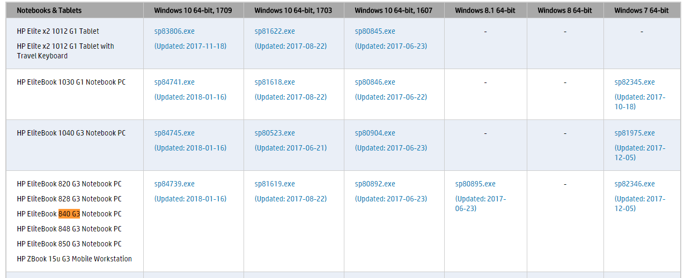


I’ll download and transfer the file to a folder I created inside the SCCM server.
Open the .exe file and extract the files to our folder.

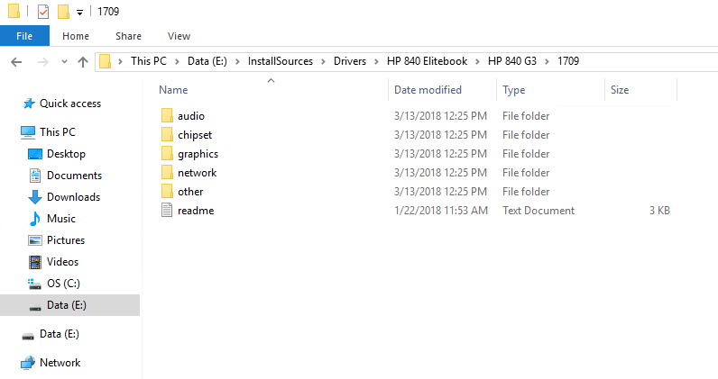

Now, go to `Software Library > Packages` and create a new regular package.


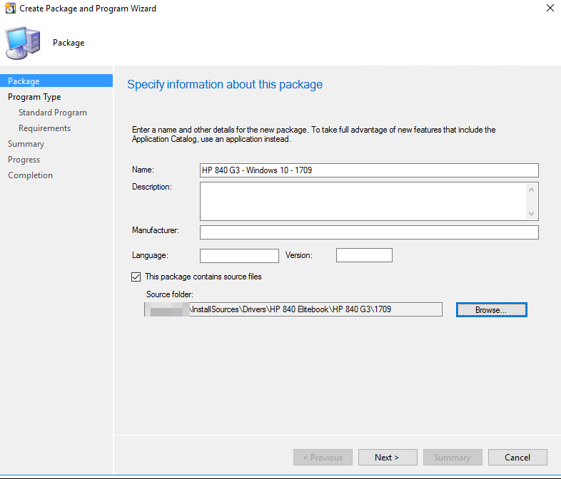
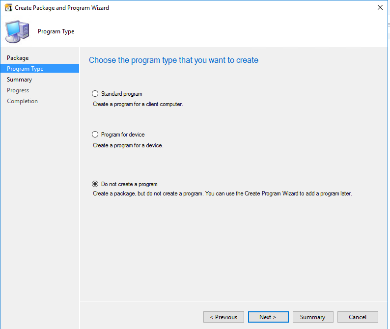

Now that the package is created, distribute it to our DP

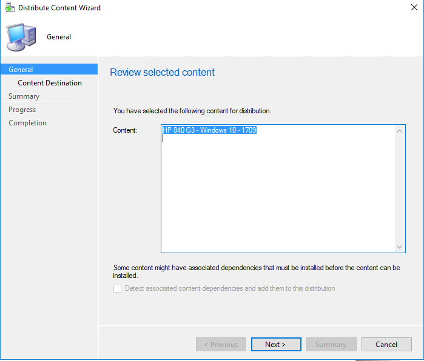
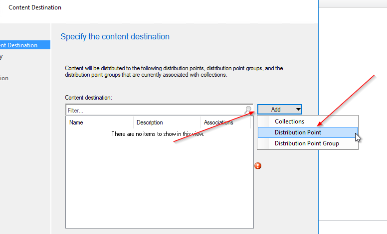
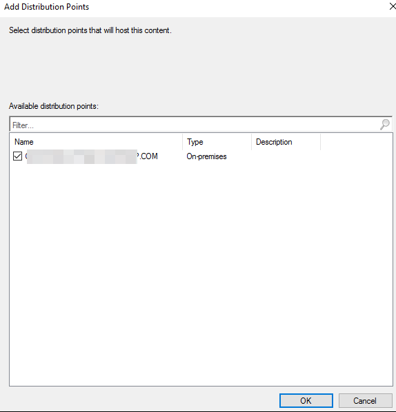

Now that we have the package, we’ll go to our TS and edit it.

We’ll go to the drivers section and create a new “command line” step.

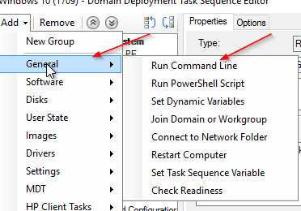

We’ll add the following command as the command line:
```
DISM.exe /Image:%OSDisk%\ /Add-Driver /Driver:.\ /Recurse
```
And choose the package we created as package:
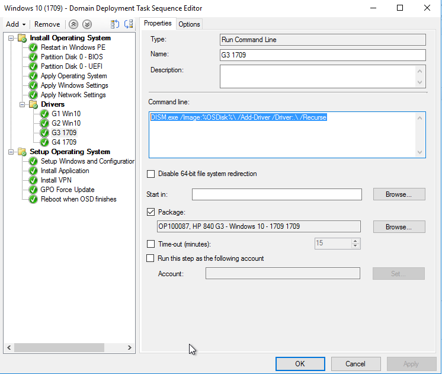

In options, we’ll create a new Query WMI and use the following statement:
```
SELECT * FROM Win32_ComputerSystem WHERE Model = "HP EliteBook 840 G3"
```


Testing this we can see it is valid:

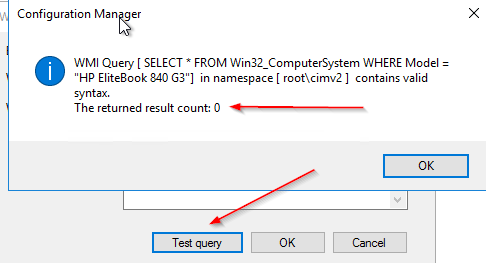

Set up Success codes as this: `2 50`

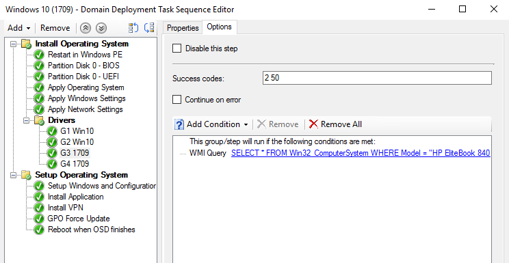

You can see it works during deployment:


That’s it.

To add new packages, for different computers, we’ll do everything the same except we need to change the Query to match the model number.

???+information
    To get a model number of a computer, use the following command in CMD: 
    ```
    WMIC CSPRODUCT GET NAME
    ```
    Always use the full name.